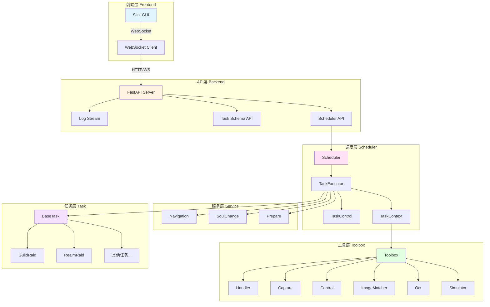
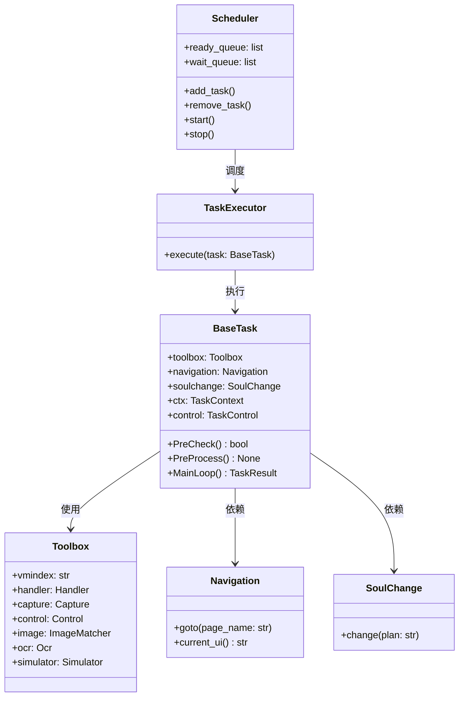
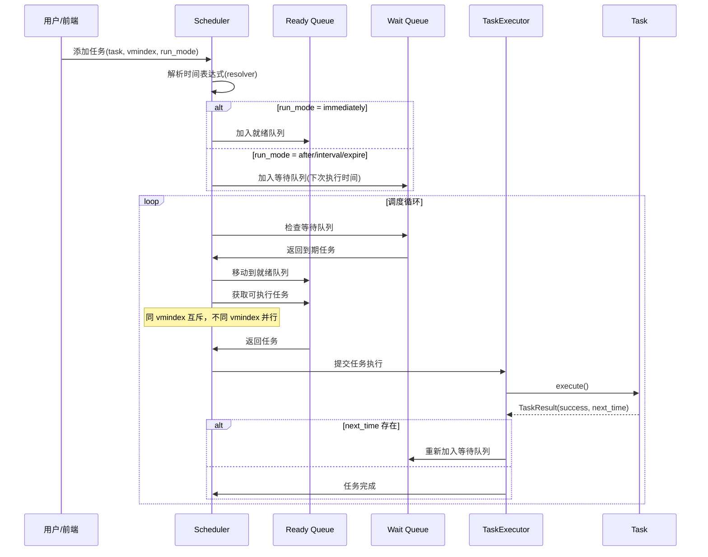
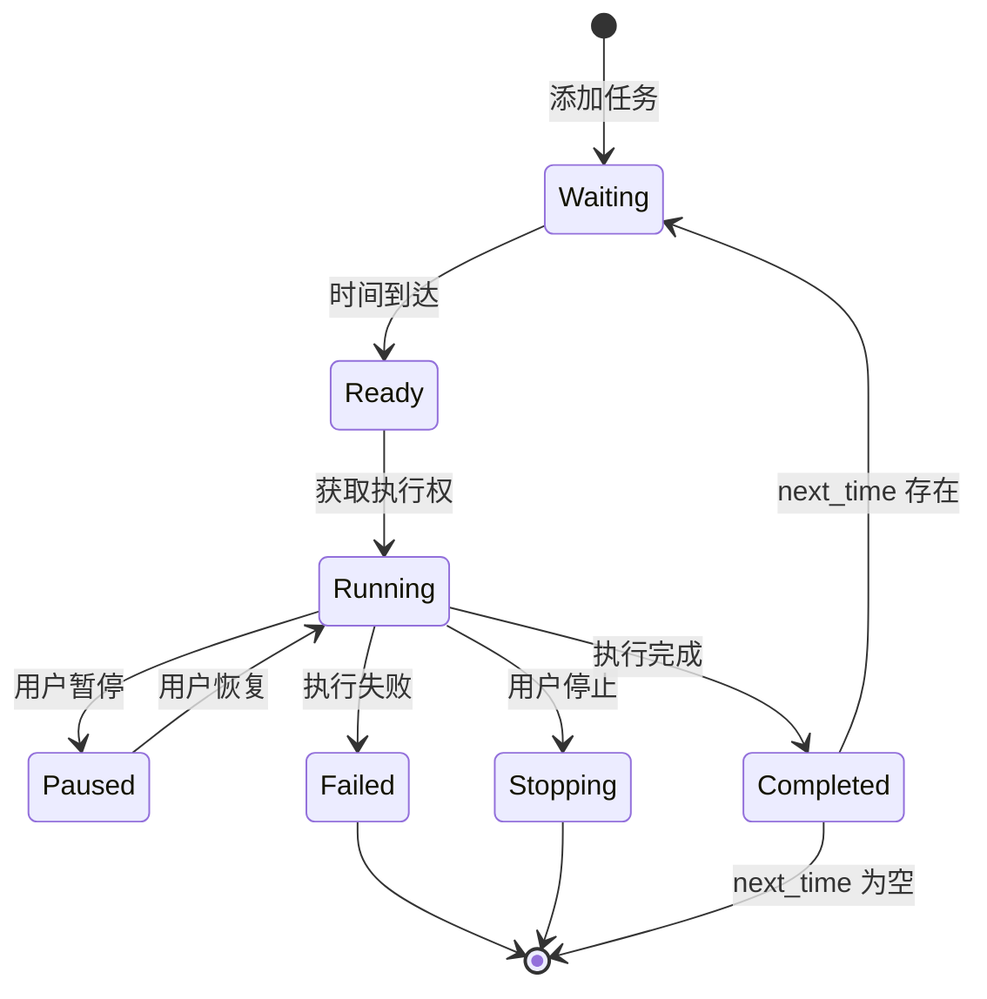
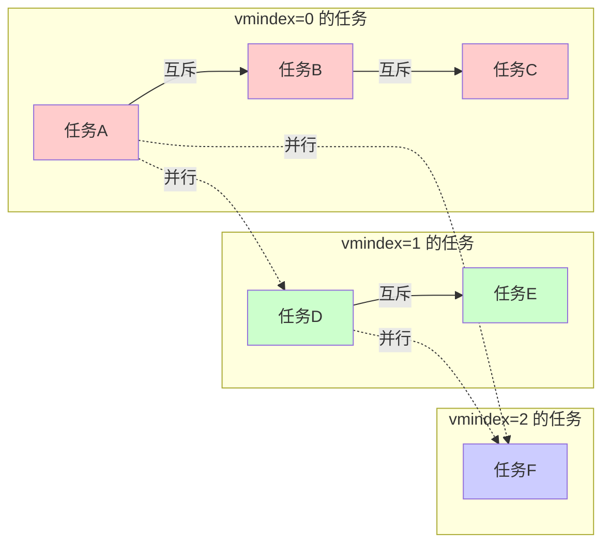
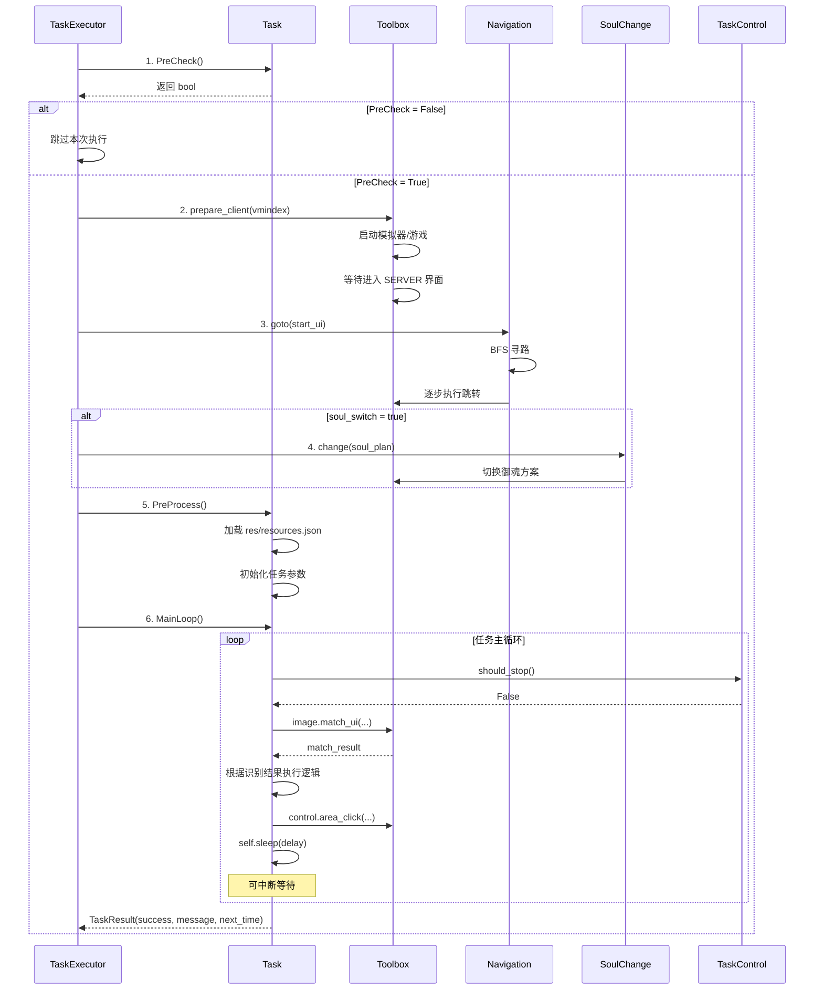
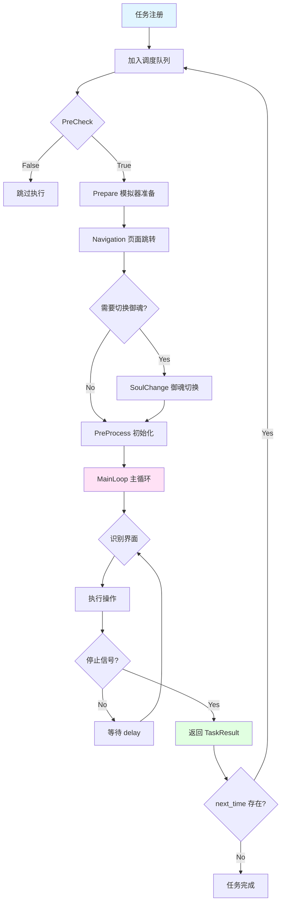
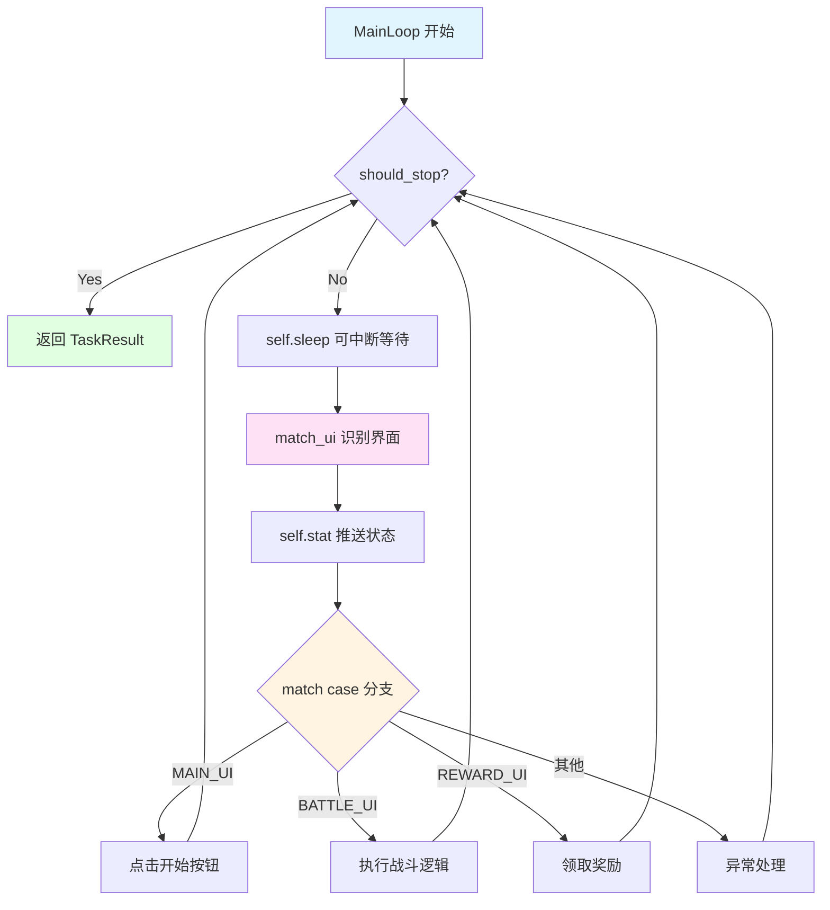
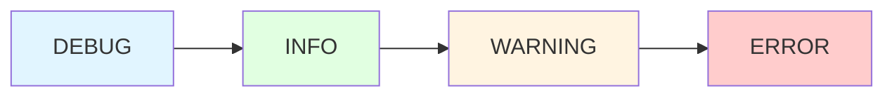

# 阴阳师自动化脚本工具 (Supaper)

基于 Python 3.12+ 的阴阳师自动化脚本工具，使用 Windows message 机制控制 MuMu 模拟器，通过 OpenCV 图像识别和 ONNX OCR 实现自动化任务。

[](https://www.python.org/downloads/)
[](LICENSE)

## ✨ 核心特性

- 🎮 **多模拟器并行支持**：每个 Toolbox 实例对应一个模拟器，互不干扰
- 📅 **灵活任务调度**：支持立即执行、定时执行、时段循环、到期自动停止
- 🔄 **智能页面导航**：BFS 寻路算法自动规划跳转路径
- 🎨 **现代化前端**：基于 Slint 的图形界面 + WebSocket 实时通信
- 🧩 **模块化任务框架**：统一的任务生命周期管理，便于扩展

---

## 📐 系统架构

### 整体架构图



### 核心模块关系



---

## 🔄 调度逻辑链

### 任务调度流程



### 任务状态转换图



### 互斥与并行规则



---

## ⚙️ 任务执行逻辑链

### 任务执行完整流程



### 任务生命周期



### MainLoop 典型模式



---

## 🛠️ 技术栈

| 层级 | 技术 | 说明 |
|------|------|------|
| **前端** | Slint | 现代化 GUI 框架 |
| **后端** | FastAPI | 异步 Web 框架 |
| **通信** | WebSocket | 实时双向通信 |
| **图像识别** | opencv-python | 模板匹配、特征检测 |
| **文字识别** | ppocr-onnx | 轻量级 OCR 引擎 |
| **窗口控制** | pywin32 | Windows API 调用 |
| **包管理** | uv | 快速依赖管理工具 |

---

## 📦 快速开始

### 安装依赖

```bash
# 使用 uv 创建虚拟环境
uv venv

# 激活虚拟环境
.venv\Scripts\activate

# 安装项目依赖（使用阿里云镜像）
uv pip install .

# 开发模式安装（包含 ruff、pytest 等）
uv pip install -e ".[dev]"
```

### 启动应用

```bash
# 推荐方式（自动使用虚拟环境）
uv run python app.py

# 或直接运行
python app.py
```

### 开发工具

```bash
# 代码检查
uv run --with ruff ruff check task/<name>

# 生成任务资源类型提示（迁移任务后必做）
uv run python DevTool/gen_res_types.py <任务目录名>

# 测试工具
uv run python DevTool/devtool.py  # 图像测试、范围颜色检测
```

---

## 📝 配置说明

### 全局配置文件

| 文件路径 | 说明 |
|---------|------|
| `pyproject.toml` | 项目依赖、uv 配置、ruff 配置 |
| `scheduler/config/client_*.json` | 各模拟器的任务参数覆盖 |

### 任务配置文件

每个任务目录（`task/<task_name>/`）包含以下配置：

```
task/guild_raid/
├── config/
│   ├── schema.json      # 前端任务库与设置窗的数据源
│   └── default.json     # 默认参数（必含全局参数）
└── res/
    └── resources.json   # 资源定义（rects/images/dirs）
```

#### 必需全局参数（所有任务必须包含）

```json
{
  "start_ui": "MAIN",           // 任务起始页面
  "soul_plan": "1,1",           // 御魂方案（组,方案）
  "soul_switch": false,         // 是否切换御魂
  "run_mode": "immediately",    // 执行模式
  "run_limit": ""               // 时间限制
}
```

#### 执行模式详解

| run_mode | run_limit 格式 | 说明 | 示例 |
|----------|---------------|------|------|
| `immediately` | 空字符串 | 立即执行 | `""` |
| `after` | `YYYY-MM-DD HH:MM:SS` | 指定时间点后执行 | `"2026-06-15 08:00:00"` |
| `interval` | `HH:MM-HH:MM` | 每日时段循环（支持跨午夜） | `"08:00-12:00"` / `"23:00-02:00"` |
| `expire` | `YYYY-MM-DD` | 期限内重复执行 | `"2026-12-31"` |

### 模拟器参数覆盖

`scheduler/config/client_0.json` 可覆盖任务的默认参数：

```json
{
  "guild_raid": {
    "ui_delay": 1.0,        // 覆盖默认的 ui_delay
    "run_mode": "interval",
    "run_limit": "08:00-23:00"
  }
}
```

优先级：`client_*.json` > `task/*/config/default.json`

---

## 🏗️ 任务开发指南

### 新任务结构

```python
from scheduler.base import BaseTask, TaskResult, register_task
from task.example.res_types import ExampleRes

@register_task("示例任务")
class Example(BaseTask):
    res: ExampleRes  # 类型标注，IDE 自动补全

    def PreCheck(self) -> bool:
        """预检：返回 False 跳过本次执行"""
        return True

    def PreProcess(self) -> None:
        """准备工作：加载资源、初始化参数"""
        super().PreProcess()  # 自动加载 res/resources.json
        self.ui_delay = float(self.params.get("ui_delay", 0.5))

    def MainLoop(self) -> TaskResult:
        """主逻辑：循环识别-操作-等待"""
        while not self.control.should_stop():
            # 可中断等待
            if not self.sleep(self.ui_delay):
                return TaskResult(success=False, message="任务已停止")
            
            # 界面识别
            match_result = self.toolbox.image.match_ui(
                [self.res.MAIN_UI, self.res.BATTLE_UI],
                timeout=10
            )
            
            # 推送状态到前端
            self.stat(1, f"[{match_result}]")  # stat card 第一行左
            
            # 根据识别结果执行操作
            match match_result:
                case "MAIN_UI":
                    self.toolbox.control.area_click(self.res.START_BTN)
                case "BATTLE_UI":
                    # 战斗逻辑
                    pass
                case _:
                    self.log.warning(f"未知界面: {match_result}")
        
        return TaskResult(success=True, message="完成")
```

### 开发流程


1. **创建目录**：`task/new_task/`
2. **编写任务类**：继承 `BaseTask`，使用 `@register_task`
3. **准备资源**：
   - `res/resources.json`（三段格式：rects/images/dirs）
   - 图片资源（文件名**必须大写**，如 `MAIN_UI.bmp`）
4. **创建配置**：
   - `config/schema.json`（前端显示）
   - `config/default.json`（默认参数，必含全局参数）
5. **生成类型提示**：`uv run python DevTool/gen_res_types.py new_task`
6. **触发注册**：在 `__init__.py` 中 `from task.new_task.new_task import NewTask`

### 关键设计约定

| 规则 | 说明 |
|------|------|
| **资源名大写** | `MAIN_UI.bmp`、`self.res.MAIN_UI`、`case "MAIN_UI"` 统一大写 |
| **日志分流** | `self.stat(1/2/3, msg)` 推送前端，`self.log.info` 记录文件 |
| **可中断等待** | 用 `self.sleep(seconds)` 代替 `time.sleep` |
| **停止检查** | 用 `self.control.should_stop()` 代替手动检查信号 |
| **页面跳转** | 用 `self.navigation.goto("PAGE")` 代替手写点击 |
| **不改原逻辑** | 迁移旧任务时只替换工具层调用，保持原有逻辑不变 |

---

## 📊 日志系统

### 日志层级



### 日志输出

| 方法 | 目标 | 用途 |
|------|------|------|
| `self.stat(1, msg)` | 前端 stat card 第一行左 | UI 识别结果 |
| `self.stat(2, msg)` | 前端 stat card 第一行右 | 进度信息 |
| `self.stat(3, msg)` | 前端 stat card 第二行 | 统计/异常 |
| `self.log.info(msg)` | 日志文件 + 前端日志页 | 流水日志 |
| `self.log.error(msg)` | 日志文件 + 前端日志页 | 错误日志 |

### 日志特性

- ✅ 自动轮转（每天 6:00）
- ✅ 智能去重（避免重复日志刷屏）
- ✅ 组件分流（`handler.component_logger("task.TaskName")`）
- ✅ WebSocket 实时推送到前端

---

## 🔧 开发工具（DevTool/）

| 工具 | 功能 |
|------|------|
| `devtool.py` | 图像测试、范围颜色检测、窗口操作的交互式工具 |
| `gen_res_types.py` | 根据 `resources.json` 自动生成类型提示文件 |
| `mask_generator.py` | 生成图像识别用的 mask |
| `sift_imgrec.py` | SIFT 特征图像识别测试 |

---

## 📚 项目文档

- **CLAUDE.md**：项目整体说明（架构、开发命令、核心模块）
- **task/MIGRATION.md**：任务迁移规范（五条铁律）
- **task/*/config/schema.json**：任务前端数据源（字段定义、类型、默认值）

---

## 🚀 高级特性

### 多模拟器并行

```python
# 每个 Toolbox 实例对应一个模拟器
tb0 = Toolbox("0")  # 控制模拟器 0
tb1 = Toolbox("1")  # 控制模拟器 1

# 不同 vmindex 的任务可并行执行
scheduler.add_task(task_a, vmindex="0")  # 与下面的任务并行
scheduler.add_task(task_b, vmindex="1")
```

### 页面导航（BFS 寻路）

```python
# 自动从当前页面跳转到目标页面
self.navigation.goto("EXPLORE")  # 自动寻路到探索页面

# 获取当前页面
current_page = self.navigation.current_ui()
```

### 御魂切换

```python
# 格式：组,方案（组范围 1-8，方案范围 1-6）
self.soulchange.change("1,2")  # 切换到第 1 组第 2 方案
```

### 嵌套子任务

```python
from dataclasses import replace

# 创建子任务实例（共享停止控制）
sub_task = SubTask(replace(self.ctx, params={"key": "value"}))
result = sub_task.MainLoop()
```

---

## 🤝 贡献指南

欢迎为项目做出贡献！请遵循以下规范：

1. **代码风格**：遵循 PEP 8，line-length=180
2. **提交规范**：使用语义化提交信息（feat/fix/refactor/docs）
3. **测试验证**：新功能需真机测试
4. **文档更新**：修改架构时同步更新 README.md

---

## 📄 许可证

本项目采用 MIT 许可证。详见 [LICENSE](LICENSE) 文件。

---

## 🙏 致谢

感谢所有为这个项目做出贡献的开发者。

---

## 📮 联系方式

如有问题或建议，请通过以下方式联系：

- 📧 提交 Issue
- 💬 Pull Request
- 📝 查看日志文件（`log/log.txt`）排查问题

---

**最后更新时间**：2026-06-14
